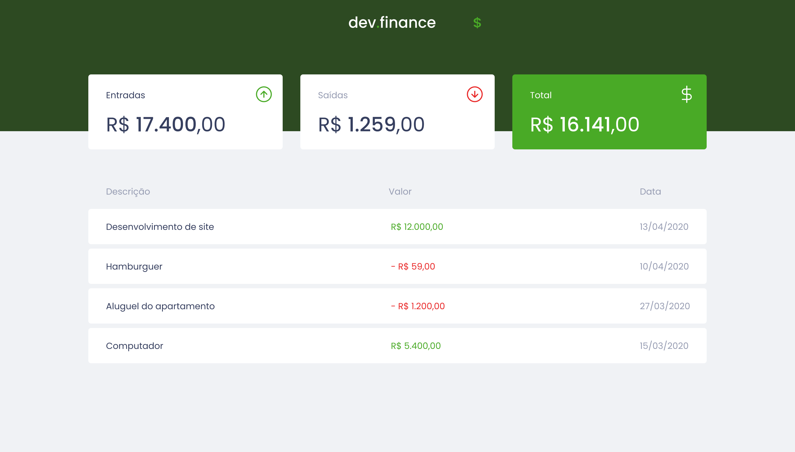

# Dev.finance$ Padrão MVC
Projeto que faz a gestão de finanças que mostra tudo que entrou de dinheiro e tudo que foi gasto, nesse projeto foi utlizado o padrão MVC e os principios do SOLID.

# Tecnologia

- Typescript
- Webpack
- Eslint
- Prettier

# Padrão de Projeto e padrão Arquitetural

- MVC

- SOLID

# Layout

